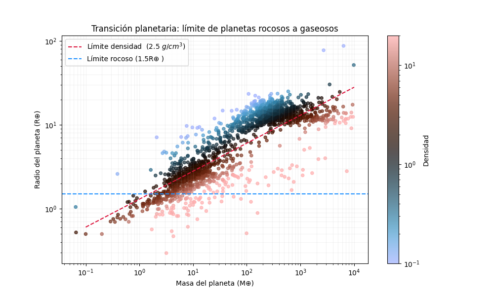

# NASA Exoplanet Archive: Transición planetaria

Este proyecto automatiza la descarga y análisis de datos de la **NASA Exoplanet Archive** para identificar la frontera entre planetas rocosos y gigantes gaseosos.

## Análisis físico

La densidad media de un planeta se define como:

$$
\rho = \frac{M}{V}
$$

Si aproximamos al planeta como una esfera de radio $R$, entonces $$ V = \frac{4}{3}\pi R³$ y por tanto:

$$
\rho = \frac{M}{{4}{3}\pi R³}
$$

Como la base de datos está en unidades de la Tierra podemos definir entonces los valores de densidad en unidades terrestres mediante la densidad relativa:

$$\frac{\rho}{\rho_{\oplus}} = \frac{M/M_{\oplus}}{(R/R_{\oplus})^3}$$

donde $p_{\oplus}$ es la densidad media de la Tierra (5.51 g/cm³), por tanto, la densidad de cada planeta en g/cm³ se puede determinar usando:

$$\rho = \left( \frac{\rho}{\rho_{\oplus}} \right) \rho_{\oplus}$$

es decir

$$\rho = \left( \frac{M/M_{\oplus}}{(R/R_{\oplus})^3} \right)  5.51 \, \text{g/cm}^3$$

Esta relación entre el radio y la masa del planeta nos permitirá inferiri su estructura interna, de modo que podemos clasificarlos en planetas rocosos densos y gigantes gaseosos esponjosos.

### Planetas compactos

Si un planeta tiene una masa alta para su radio o un radio pequeño para su masa, entonces su densidad media será alta, lo cual es característico de planetas con composiciones dominadas por roca, silicatos, hierro y núcleos compactos.

### Planetas inflados

Si un planeta tiene un radio muy grande para su masa o una masa relativamente baja para un radio grande entonces su densidad es es baja, lo cual sugiere presencia de envolturas de hidrógeno y helio, capas volátiles y estructuras menos compactas.

## Criterio observacional y criterio físico

Se ha encontrado observacionalmente que muchos planetas con radios mayores a

$$ R \approx 1.5-1.6 R_{\oplus} $$

dejan de ser consistentes con composiciones puramente rocosas (este es un criterio físico basado en la población observada)

Pero podemos hacer uso de la de densidad relativa para determinar físicamente este criterio.

Partimos de la relación:

$$\rho = \left( \frac{M/M_{\oplus}}{(R/R_{\oplus})^3} \right) 5.51 \, \text{g/cm}^3$$

Si se fija una densidad de referencia $\rho_{lim}$, de modo que:

$$ \frac{\rho_{lim}}{\rho}=\frac{M}{R³}

y despejando $R$, se tiene que:

$$R = \left( \frac{M}{\rho_{\text{lim}} / \rho_{\oplus}} \right)^{1/3}$$

vemos que esta ecuación define una curva teórica de densidad constante en el plano masa-radio.

En este análisis se utilizó una densidad de referencia del orden de:

$$p_{lim} ∼ 2.5 \, \text{g/cm}³$$

como una frontera visual aproximada entre planetas compactos de alta densidad y planetas inflados de baja densidad.
Cabe aclara que esta elección no representa una frontera universal exacta, sino una herramienta de interpretación física. En la práctica, el valor preciso puede desplazarse ligeramente dependiendo de la muestra observacional. 

## Visualización de resultados

La distribución observada en el diagrama masa–radio muestra que los planetas pequeños y densos se concentran en la región de radios bajos y densidades relativamente altas.
Estos son los objetos más compatibles con composiciones rocosas o núcleos compactos.

Por otro lado, los planetas de mayor radio para una misma masa presentan densidades menores, lo cual indica que una composición rocosa no explica su tamaño, por lo cual podríamos considerar la presencia de envolturas gaseosas.

Vemos entonces que la línea roja discontinua representa el límite de **3.5 g/cm³** (el promedio de la densidad de silicatos/rocas). Los puntos rojos por debajo de la línea son planetas compactos y rocosos, mientras que los puntos azules que se alejan hacia arriba de la línea representan planetas que han "inflado" su radio con atmósferas masivas, convirtiéndose en gigantes gaseosos o "Neptunos calientes".

